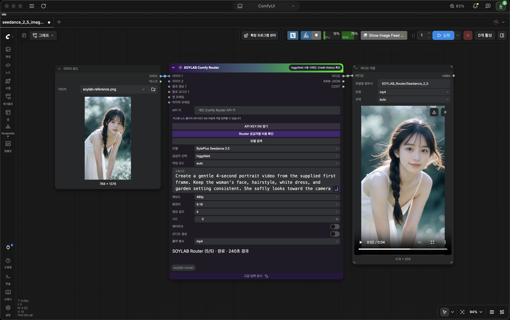

# SOYLAB Comfy Router

[GitHub](https://github.com/soylab-edu/ComfyUI-soylab-router) · [SOYLAB YouTube](https://www.youtube.com/@soy_lab) · [SOYLAB website](https://soylab.ai/)

**Languages:** [한국어](README.md) · [English](README.en.md) · [日本語](README.ja.md) · [简体中文](README.zh-CN.md)



A local ComfyUI custom node that calls [Comfy Router](https://comfy.org/platform/router) with your personal Comfy API key. The purple node uses the supplied Soylab mark and purple-to-green header. Its two selection controls are **Model** and **Provider**. Model entries show names such as `Runway Gen-4 Turbo Video` and `BytePlus Seedance 2.5`; Provider lists only Router execution paths available for the chosen model. New nodes default to `BytePlus Seedance 2.5` with `higgsfield`. Reference sockets use native `Autogrow` with model-specific caps.

Node descriptions, input hints, and the price panel follow ComfyUI's **Settings → Language** (`Comfy.Locale`): Korean, English, Japanese, and Simplified Chinese. Korean is the fallback when no language is set. Restart ComfyUI and reload the browser after installing locale files. Model names and provider IDs retain their API spelling.

This node sends REST requests with Python's standard library. The SDK installations in the Router quickstart (`comfy-sdk`, `@comfyorg/sdk`, or Swift SDK) are alternative examples for other applications and are not required here. The node submits to Router's queue, follows the reported queue and generation state, then collects and downloads the result. If Router reports `403 not_enabled` for the queue, image calls use the synchronous route and label the wait accordingly. Video and audio calls stop before generation rather than risk Router's synchronous 10-minute deadline.

## Install

A current ComfyUI release with V3 `DynamicCombo` and `Autogrow` support is required. [Version 1.0.0 is published in Comfy Registry](https://registry.comfy.org/nodes/soylab-comfy-router). It may take time to appear in ComfyUI-Manager search while Registry processes the version.

### Ask ChatGPT Desktop to install it

On the computer running ComfyUI, open a ChatGPT Desktop session that can access local folders and enter this request. If asked for a path, provide the ComfyUI installation you actually use. Restart ComfyUI after installation.

```text
Install https://github.com/soylab-edu/ComfyUI-soylab-router in ComfyUI.
```

### Install manually with Git

1. Install [Git](https://git-scm.com/downloads) and locate the **ComfyUI installation you actually use**. For a regular installation, start in the `ComfyUI` directory that contains `main.py`.
2. Open a terminal there, then copy and run both lines:

   ```bash
   cd custom_nodes
   git clone https://github.com/soylab-edu/ComfyUI-soylab-router.git
   ```

   **Windows Portable:** Open Command Prompt in the `ComfyUI_windows_portable` directory containing `run_nvidia_gpu.bat`, then run:

   ```bat
   cd ComfyUI\custom_nodes
   git clone https://github.com/soylab-edu/ComfyUI-soylab-router.git
   ```

   If you already opened `custom_nodes`, run only the `git clone` line. In Windows File Explorer, type `cmd` in that folder's address bar to open Command Prompt there. Installation creates `custom_nodes/ComfyUI-soylab-router`.

3. Fully stop and restart ComfyUI, then refresh the browser. Check the startup log for `import failed`. This node has no separate `requirements.txt` or `pip install` step.
4. Create a key at the [Comfy Developer Platform API keys page](https://platform.comfy.org/profile/api-keys?onboarding=router) and add credits to the workspace if needed.
5. Enter the key in the node's `api_key` field **or** use its local key-file button. When `API KEY.INI` is absent, the button says **Create INI file and enter key**; when present, it says **Open API KEY.INI**. Clicking it creates a private blank file if needed and opens it in the operating system's text editor. The status check returns only whether the file exists, never its contents. You can also copy `API KEY.INI.example` manually. `API KEY.INI` is ignored by Git. A key typed into a node may be saved in a workflow export, so clear that field and use the INI file for shared workflows.
6. Add **SOYLAB Comfy Router** from **Soylab / Comfy Router**. Choose a model, an available Router provider, resolution and any references. Connect the active `IMAGE`, `VIDEO` or `AUDIO` output to a save node, then queue the workflow.

If installed with Git, run `git pull` inside `ComfyUI-soylab-router` and restart ComfyUI. Do not clone a second copy into the same folder.

See [Comfy Registry publication details](REGISTRY.md) for status and future updates.

The `workflows` folder contains a [Seedance 2.5 image-to-video example](workflows/seedance_2_5_image_to_video.json) and a [GPT Image 2 image-editing example](workflows/image_edit_gpt_image_2.json). Both use [the reference image with workflow metadata removed](workflows/soylab-reference.png). Copy the image into ComfyUI's `input` folder before opening a sample. The video sample connects Load Image → Router → Save Video and embeds [Korean](workflows/USAGE.ko.md) and [English](workflows/USAGE.en.md) usage notes. Neither workflow contains an API key.

## Included model families

| Service | Models | Media |
| --- | --- | --- |
| Runway | Gen-4 Turbo Video, Gen-4 Image, Aleph 2 | Image, video |
| Dreamina | Seedance 2.5 / 2.0 / Fast / Mini; Seedream 5 Pro / Lite | Image, video, audio according to model |
| OpenAI | GPT Image 2 / 2.5 Flare / 2.5 Sunburst | Image |
| Google | Nano Banana 2 / 2 Lite / Pro | Image |
| BytePlus Audio | Seed Audio 1.0 / Multilingual | Image or audio reference; audio output |

The maximum reference sockets are taken from the model's [Router schema](https://docs.comfy.org/development/comfy-router/models) or the matching official ComfyUI Partner node implementation. For example, Seedance 2.5 has 30 image, 10 video and 10 audio reference slots; GPT Image 2 has 16 image slots. Unsupported media outputs are hidden in Nodes 2.0; the registered output types stay fixed for graph compatibility.

Seedance exposes a visible **Task mode** selector with `auto`, `text`, `image`, and `reference`. Seedance 2.5 also offers `edit` and `extend`, following the installed official Partner node. In `image` mode, or `auto` mode with image inputs only, `image_1` is the first frame and `image_2` is the last frame. Existing `first_frame` and `last_frame` sockets remain supported, but do not connect both sockets for the same frame. In `reference` mode, numbered image sockets remain reference images; `edit` and `extend` need a video reference. For the Higgsfield serving route, connected Seedance images are uploaded to Comfy's signed storage first because its image-to-video API requires a reachable image URL. Editing follows the Partner node's native `duration=-1` and `ratio=adaptive` behavior. The Router schema does not explicitly list `omni_reference_task_type`; alternate serving provider translations of `edit` and `extend` are unverified, so the node permits those two modes only on the Comfy route. Seedream 5 Pro exposes `standard`/`fast` prompt optimization with reference images. Seed Audio exposes `auto`, `text`, `audio`, `image`, and `preset_voice` reference modes, with the installed Partner node's voice choices. The node validates mismatched media before a paid request.

During a run, the node sends status through ComfyUI's native Partner Node progress text channel, shown at the bottom in Nodes 1.0 and 2.0. It groups work into five steps—prepare inputs, submit, queue/generate, collect/download, complete—and shows `(step/5)` with elapsed seconds. Router publishes only `IN_QUEUE`, `IN_PROGRESS`, and `COMPLETED`; these are real states, not a percent estimate. An image model without queued delivery falls back to one synchronous request, which can show only that it is waiting for the provider. Restart ComfyUI after updating the Python code, then reload the browser when the current workflow has finished.

If an older version returned `504 deadline_exceeded` after a long video call, that synchronous request may still have reached its provider and may have been charged. Do not treat the error as proof that nothing was generated, and do not resubmit it automatically. For a photo that must be the exact first frame, select Seedance `auto` or `image` mode and connect the photo to `image_1`; use `image_2` for the last frame. Set `duration` to the intended length even when the text prompt also names a length. A workflow export or error report can contain a key typed into the node: remove that value, rotate an exposed key, and put the replacement in `API KEY.INI`.

The [Router models list](https://docs.comfy.org/development/comfy-router/models) groups canonical model IDs by their first path segment: `runway/gen4_turbo` and `byteplus/dreamina-seedance-2-5-260628` are valid model IDs. That segment identifies the model's registered provider. The Provider control selects the **serving provider** used for the request: `Comfy` is the default, while other entries use Router's `model_provider` option. The [serving provider coverage](https://docs.comfy.org/development/comfy-router/providers) lists no `Dreamina` alternate route for Seedance 2.5 and no `Runway` alternate route for Gen-4 Turbo. A Runway direct API price in the header is a separate comparison.

## Cost display

The header shows a **direct maker API price** only where a public pricing rule was verified (currently Runway) and a **Comfy credit estimate** where the installed Partner node's published USD price formula can be mapped to these controls. Comfy's published conversion is **$1 = 211 credits**. For Seedance 2.5 and 2.0, the selected Comfy route also shows estimated credits per second. Click **Router 공급자별 비용 확인** on the node or its header cost badge to open a comparison panel; it updates when the model, route, resolution, duration or ratio changes. Image models with a known Comfy estimate show credits per run.

[Comfy's official Partner Node price list](https://docs.comfy.org/tutorials/partner-nodes/pricing) gives public rates for the default Comfy route. The [Router catalog API](https://docs.comfy.org/development/comfy-router/reference) lists models and billing behavior but explicitly omits prices and usage, so an alternate route has no documented pre-run quote. The comparison panel displays the official Comfy baseline separately from any selected alternate route and never treats one as the other's price. After a successful call, the header, panel and `COST` output show **사용 크레딧** only when Router supplies `X-Comfy-Credits-Used`. Queued result collection may omit this optional header; in that case the node says to check Comfy Credit History and never treats a missing value as zero. The frontend saves up to 40 known positive model, route and settings credit totals in this browser so a later run can show a clearly labeled previous usage; no API key or prompt is stored in that history. Prior results are not a guaranteed future price.

Until Router publishes route-specific pre-run prices, [`web/router-data.json`](web/router-data.json) tracks dated, sourced **direct provider API USD reference rates** for comparable settings. For alternate routes, the header converts that direct USD rate using Comfy's published **$1 = 211 credits** rate and displays the estimated **total for the selected duration**. It is not a Router quote or a guaranteed charge. The comparison panel shows the direct API reference separately from an actual Router bill; after a run, an actual Router credit header takes precedence. The Runware Seedance 2.5 reference applies to text-to-video or one connected image/first frame, per Runware's published price; multiple references, video/audio references, edit, and extend have no comparable reference here. A provider's previous actual Router credit usage remains local to the browser; add a Git-tracked Router rate only after its exact settings and billed credits have been independently verified. If Comfy later publishes official route prices, use that source in preference to these direct API comparisons.

### Maintain model and price data

Run `python scripts/refresh_media_catalog.py` to reload the official model and serving-provider lists and each authenticated OpenAPI schema. The script reads the local ignored `API KEY.INI` or `COMFY_API_KEY` and never writes the key into the generated files. Review and commit [the catalog](web/router-data.json) and [schema snapshot](model-schemas.json) together. Public pricing references still need manual source and date verification.

[`web/router-data.json`](web/router-data.json) is the single editable catalog for model names and IDs, serving providers, media socket limits, supported resolutions, quality options, and pricing rules. Each `models[]` entry contains its `providers` and `pricing` objects. Edit `pricing.comfy` for the published Comfy baseline, `pricing.maker` for the model maker's own API, or `pricing.alternates.<provider>` for a dated direct-provider comparison. Keep the source URL and `checked_at` next to each alternate price, then update the top-level `updated_at`. The Python node controls and browser price display both read this file, so changing existing model or provider data does not require editing calculation code. Restart ComfyUI after editing to rebuild its model and input controls, then reload the browser to refresh the displayed rates. Adding a new model that needs a different native request or response format still requires an adapter implementation and schema verification; a JSON entry alone cannot make an unsupported API request work.

Resolution is part of every price lookup. [Higgsfield's app changelog](https://www.higgsfield.company/creator-hub/changelog) confirms Seedance 2.5 generation at 1080p, and the [Router model schema](https://docs.comfy.org/router-schemas/byteplus/dreamina-seedance-2-5-260628.json) accepts 1080p while its [provider coverage](https://docs.comfy.org/development/comfy-router/providers) includes Higgsfield. However, Higgsfield's [public direct API reference](https://open.higgsfield.ai/models/bytedance/seedance-2.5/text-to-video/api-reference) still lists only 480p and 720p and publishes no 1080p direct API price. The node therefore permits Higgsfield 1080p through Router but labels that route and price as unverified until an actual Router run confirms its output and charge; the 480p–720p direct API range is never applied to 1080p. The fal direct API currently documents only 480p and 720p, so this node still blocks fal 1080p. Runware and WaveSpeed references use their published per-resolution rates. Where a model actually offers 4K, such as Seedance 2.0, the [official Partner Node price table](https://docs.comfy.org/tutorials/partner-nodes/pricing) supplies the Comfy 4K token rate; the estimate also uses the selected aspect ratio. The [Runware](https://runware.ai/seedance-2-0) and [WaveSpeed](https://wavespeed.ai/models/bytedance/seedance-2.0/text-to-video) 4K direct API reference rates are recorded separately. Seedance 2.5 does not expose a 4K option in this node.

The request uses the documented `POST /v2/models/{provider}/{model}/requests` queue route, with the synchronous model route as the documented `not_enabled` fallback. Optional alternate providers are shown only for canonical models whose published schema advertises them. `advanced_json` merges additional native request fields; it cannot override the model path. Video references that require an HTTPS URL are uploaded through Comfy's signed `/customers/storage` flow using the same API key.

## Current boundaries

- The catalog contains 154 image and video models from the [public Router models page](https://docs.comfy.org/development/comfy-router/models). Click **Search models** above the model selector and type a name or ID fragment; `wa` shows Wan models. Native fields follow the checked-in [model schemas](model-schemas.json), with nested media handling based on the ComfyUI Partner API nodes. All 154 default requests and response examples pass local schema checks; paid generation was not run for every model and input combination.
- A provider may reject a reference format or parameter even if the shared Router schema admits it. The API key and credits are needed for a live end-to-end run, which is not included in the repository tests.
- The audio decoder currently returns PCM WAV; `Seed Audio` requests WAV output. Other audio codecs can be added later.
- The generated media is downloaded immediately because some provider URLs expire. `RAW JSON` contains the native provider response for inspection.
